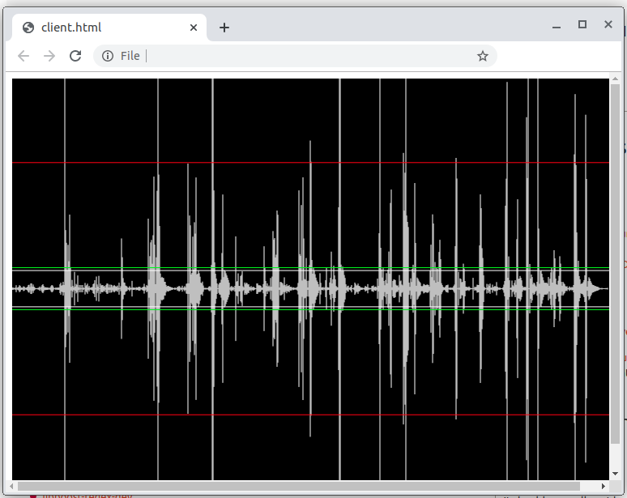

# Audio input visualizer

This simple utility can be used to visualize audio input in web browser in real time.
It consists of a C++ backend that records audio and sends it to a Javascript frontend via websocket.

## Requirements
* Boost
* PortAudio

## Installation
* Obtain Boost:
`sudo apt install libboost-dev`
* Obtain PortAudio from here: http://portaudio.com/docs/v19-doxydocs/compile_linux.html
* Compile audio server
`cd src && g++ main.cpp -L/usr/local/lib -lportaudio -lpthread -o ../audioServer`
* Add content of client.html into the website

## Usage
```
./audioServer [-p PORT]
xdg-open ./client.html
```

## Example


## License
[MIT](https://choosealicense.com/licenses/mit/)
